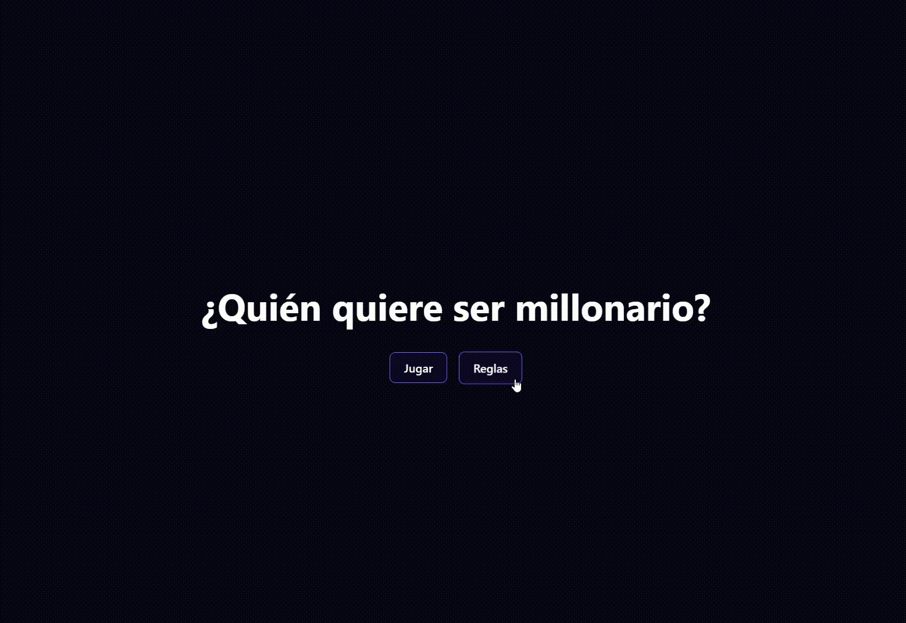

# Juego de Preguntas en React

Este proyecto es un juego de preguntas simple desarrollado en React utilizando Vite y React Router. El juego consta de 20 preguntas en total, y para cada pregunta, el jugador debe elegir la opción correcta de entre 4 opciones posibles.

## Características

- Juego de 20 preguntas con múltiples opciones.
- Utiliza React y React Router para la navegación entre preguntas.
- Puntuación en tiempo real.
- Pantalla de resultado al final del juego.

## Capturas de Pantalla


## Instalación

1. Clona este repositorio.

    ```bash
    git clone https://github.com/Rafacv23/questions-game.git
    cd questions-game
    npm install 
    npm run dev
    ```

## Demo

Puedes ver una demo en vivo de este proyecto [aquí](https://questions-game-iota.vercel.app/).